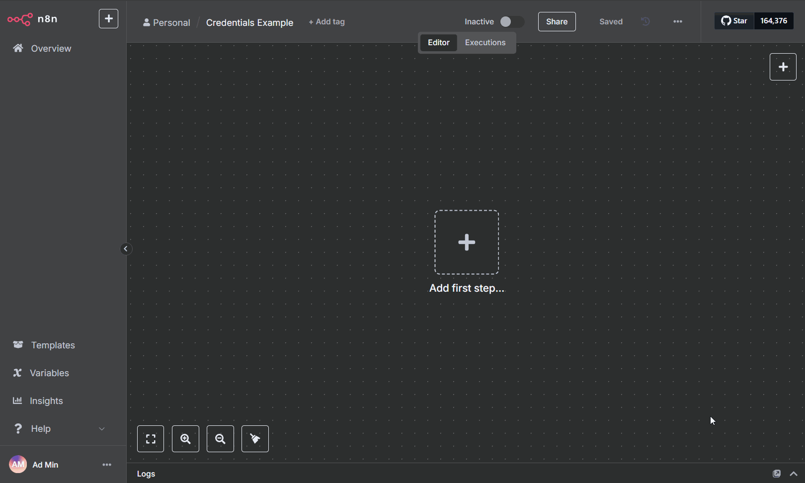
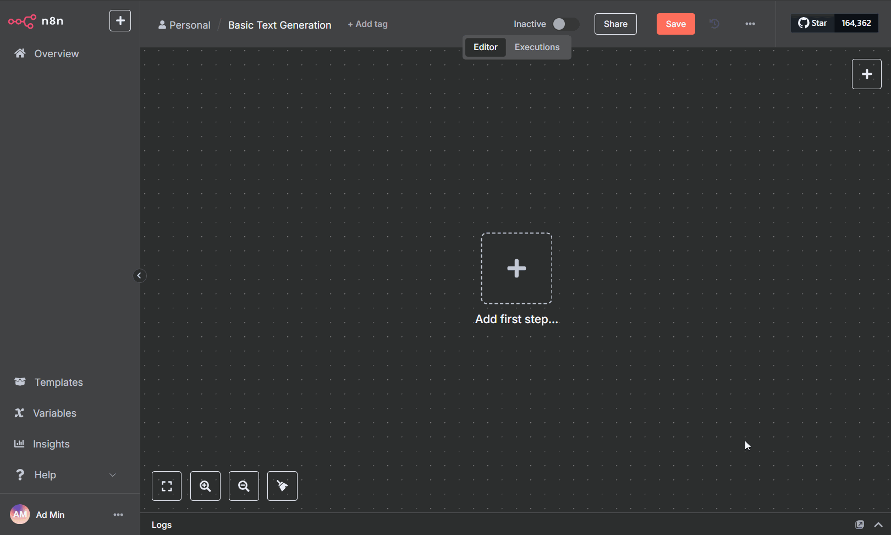
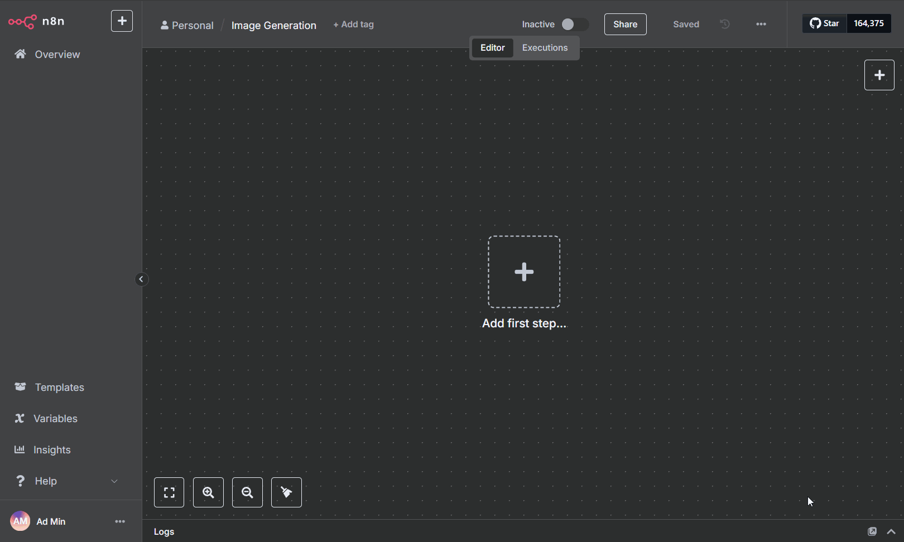

# n8n-nodes-chutes


This is an n8n community node that provides complete access to Chutes.ai's AI services, replicating all features available in the Chutes.ai playground including text generation, image generation, and custom inference.

[Chutes.ai](https://chutes.ai) is an advanced AI platform that provides state-of-the-art models for various AI tasks with a focus on performance and reliability.

## Installation

### Community Node (Recommended)

1. Go to **Settings** > **Community Nodes** in your n8n instance
2. Search for `n8n-nodes-chutes`
3. Click **Install**

### Manual Installation

```bash
npm install n8n-nodes-chutes
```

For self-hosted n8n instances:

```bash
cd ~/.n8n
npm install n8n-nodes-chutes
```

## Authentication (With Example)

To use this node, you'll need an API key from Chutes.ai:

1. Sign up at [chutes.ai](https://chutes.ai)
2. Navigate to your [API Keys dashboard](https://chutes.ai/app/api)
3. Create a new API key (you will only be shown it once)
4. Add the key to your n8n credentials:
   - Go to **Credentials** > **New**
   - Select **Chutes API**
   - Enter your API key
   - Choose your environment (Production/Sandbox)
   - Save



## Features

This node provides complete access to all Chutes.ai playground features:

### 📝 Text Generation
- **Complete**: Generate text completions with all available models
- **Chat**: Interactive conversations with context and message history
- **Modern Best Practices**: Both operations use the Chat Completions API (`/v1/chat/completions`) following industry standards
- All playground parameters:
  - Temperature (0-2)
  - Max tokens
  - Top P (nucleus sampling)
  - Frequency/presence penalties
  - Stop sequences
  - Response format (text/JSON)
  - Streaming support (planned)
  - Seed for reproducibility

### 🎨 Image Generation
- **Generate**: Create images from text prompts
- Multiple size options (256x256 to 1792x1024)
- Quality settings (Standard/HD)
- Style presets (Natural/Vivid)
- Negative prompts
- Guidance scale control
- Seed for reproducibility
- Batch generation support

### 🔧 Inference (coming soon)
- **Predict**: Run custom model inference
- **Batch**: Process multiple inputs efficiently
- **Status**: Check job status for long-running operations
- Support for custom models deployed on Chutes.ai
- Webhook callbacks for async operations
- Priority queue management

## Three Ways to Use Chutes.ai with n8n

This package provides three complementary nodes for different use cases:

### 1. Chutes (Original Workflow Node)

**Use when:** You need direct control over API calls and access to all Chutes.ai features

**Features:**
- 📝 Text generation (completions and chat)
- 🎨 Image generation
- 🎵 Music generation
- 🎤 Speech-to-text and text-to-speech
- 🎥 Video generation
- 📊 Embeddings
- 🛡️ Content moderation
- 🔧 Custom inference

**Perfect for:** Complex workflows that require full control over Chutes.ai API parameters

### 2. Chutes Chat Model

**Use when:** You want to use Chutes.ai with an available AI Agent node

**Features:**
- ✅ Works with Chutes AI Agent
- ✅ All Chutes LLM models (DeepSeek, Qwen, etc.)
- ✅ Dynamic chute/model selection
- ✅ Temperature and advanced parameters
- ✅ Compatible with AI Agent's Tools, Memory, and Output Parsers

**Quick Start:**
1. Add a **Chutes Chat Model** node
2. Select your chute and model
3. Connect to **AI Agent** node's model input

### 3. Chutes AI Agent (New!)

**Use when:** You want n8n's full AI Agent experience, but exclusively with Chutes.ai models

**Features:**
- 🤖 Functions identically to n8n's AI Agent
- 🔒 **Whitelisted** - Only accepts Chutes Chat Model (ensures Chutes.ai integration)
- 🛠️ Full support for Tools, Memory, and Output Parsers
- 💬 Multi-turn conversations with context
- 🎯 System message configuration
- 🔄 Max iterations control
- 📊 Intermediate steps tracking

**Perfect for:** Full AI Agent workflows that must use Chutes.ai models only

**Quick Start:**
1. Add **Chutes Chat Model** node
2. Configure your chute and model
3. Add **Chutes AI Agent** node
4. Connect Chutes Chat Model to its Chat Model input
5. (Optional) Add Tools, Memory, Output Parser
6. Configure prompt and system message
7. Execute!

**Why This Node?** n8n's official AI Agent has a hardcoded whitelist that can limit community model integration. The Chutes AI Agent provides the same functionality while ensuring seamless Chutes.ai integration.

### Which Node Should You Use?

| Use Case | Recommended Node |
|----------|-----------------|
| Complex workflows with multiple AI operations | **Chutes** (Original) |
| Using Chutes official AI Agent with Chutes models | **Chutes Chat Model** |
| AI Agent that ONLY works with Chutes models | **Chutes AI Agent** |
| Image/video/audio generation | **Chutes** (Original) |
| Custom model inference | **Chutes** (Original) |
| Embeddings and content moderation | **Chutes** (Original) |
| Tools, Memory, Output Parser with Chutes | **Chutes AI Agent** |

### Three Nodes, One Package

When you install `n8n-nodes-chutes`, you get all three nodes:

1. **Chutes** - Traditional workflow node for direct API calls to all Chutes.ai features
   - Text generation, image generation, speech, video, embeddings, etc.
   - Full control over API parameters
   
2. **Chutes Chat Model** - LangChain-compatible chat model node
   - Connects to Chutes official AI Agent
   - Provides Chutes.ai LLM models to any AI Agent
   - `NodeConnectionType.AiLanguageModel` output
   
3. **Chutes AI Agent** - Complete AI Agent with Chutes-only whitelist
   - Clone of n8n's AI Agent structure
   - **Only accepts Chutes Chat Model** (whitelisted at input level)
   - Full Tool, Memory, and Output Parser support
   - Perfect for workflows that must use Chutes.ai exclusively

Use the right node for your use case (see the comparison table above).

📚 **Full Guide**: See [docs/AI-AGENT-INTEGRATION.md](docs/AI-AGENT-INTEGRATION.md) for detailed examples and best practices.

## Usage Examples

### Basic Text Generation

Generate creative text using Chutes.ai's LLM models:



<details>
<summary>Click to see full JSON example node</summary>

```json
{
  "nodes": [
    {
      "parameters": {},
      "type": "n8n-nodes-base.manualTrigger",
      "typeVersion": 1,
      "position": [
        0,
        0
      ],
      "id": "207576a8-03fc-427c-b6e3-475891b30a52",
      "name": "When clicking ‘Execute workflow’"
    },
    {
      "parameters": {
        "chuteUrl": "https://chutes-deepseek-ai-deepseek-v3-0324-tee.chutes.ai",
        "prompt": "Write a story about a cat with a hat that sat on a fat stack of pancakes, with syrup dribbled down the side of the pancakes.",
        "additionalOptions": {}
      },
      "type": "CUSTOM.chutes",
      "typeVersion": 1,
      "position": [
        220,
        0
      ],
      "id": "a5e63622-183d-4ac2-84f7-576b6e04ff0b",
      "name": "Chutes",
      "credentials": {
        "chutesApi": {
          "id": "Lv1zGZROIfHD4yIL",
          "name": "Chutes account"
        }
      }
    }
  ],
  "connections": {
    "When clicking ‘Execute workflow’": {
      "main": [
        [
          {
            "node": "Chutes",
            "type": "main",
            "index": 0
          }
        ]
      ]
    }
  },
  "pinData": {},
  "meta": {
    "templateCredsSetupCompleted": true,
    "instanceId": "0766e26a38e4cf9836ab30499d93ee64e5c7b0eae3f1edb925460d34cf41d5c5"
  }
}
```

</details>

### Chat Conversation

Have a multi-turn conversation with context (this example includes basic troubleshooting):


<details>
<summary>Click to see full JSON example node</summary>

```json
{
  "nodes": [
    {
      "parameters": {},
      "type": "n8n-nodes-base.manualTrigger",
      "typeVersion": 1,
      "position": [
        0,
        0
      ],
      "id": "c7bf314b-4232-4f02-9146-439e30aa7437",
      "name": "When clicking ‘Execute workflow’"
    },
    {
      "parameters": {
        "chuteUrl": "https://chutes-moonshotai-kimi-k2-thinking.chutes.ai",
        "operation": "chat",
        "messages": {
          "messageValues": [
            {
              "role": "system",
              "content": "you are the HAL9000 before it went insane, be helpful like the computer in the movie, you are to pretend you are in the movie 2001 a space odyssey, and will not break character. if the user asks questions they are also pretending to be in the movie."
            },
            {
              "content": "can you guess how long before we reach Jupiter, HAL?"
            }
          ]
        },
        "additionalOptions": {
          "maxTokens": 10000
        }
      },
      "type": "CUSTOM.chutes",
      "typeVersion": 1,
      "position": [
        220,
        0
      ],
      "id": "7beb97a8-a59c-4041-b7f2-6be1901c79eb",
      "name": "Chutes",
      "credentials": {
        "chutesApi": {
          "id": "Lv1zGZROIfHD4yIL",
          "name": "Chutes account"
        }
      }
    }
  ],
  "connections": {
    "When clicking ‘Execute workflow’": {
      "main": [
        [
          {
            "node": "Chutes",
            "type": "main",
            "index": 0
          }
        ]
      ]
    }
  },
  "pinData": {},
  "meta": {
    "templateCredsSetupCompleted": true,
    "instanceId": "0766e26a38e4cf9836ab30499d93ee64e5c7b0eae3f1edb925460d34cf41d5c5"
  }
}
```

</details>

### Image Generation

Create stunning images from text descriptions:




<details>
<summary>Click to see full JSON example node</summary>

```json
{
  "nodes": [
    {
      "parameters": {},
      "type": "n8n-nodes-base.manualTrigger",
      "typeVersion": 1,
      "position": [
        0,
        0
      ],
      "id": "4bee9ada-56fe-4cc1-9490-ce87839077dd",
      "name": "When clicking ‘Execute workflow’"
    },
    {
      "parameters": {
        "resource": "imageGeneration",
        "chuteUrl": "https://chutes-qwen-image.chutes.ai",
        "prompt": "a cat in a hat that sat on a fat stack of pancakes, maple syrup flows down the side of the pancakes",
        "additionalOptions": {}
      },
      "type": "CUSTOM.chutes",
      "typeVersion": 1,
      "position": [
        220,
        0
      ],
      "id": "13f40013-4da6-4bc6-b909-95e8e7b1594d",
      "name": "Chutes",
      "credentials": {
        "chutesApi": {
          "id": "Lv1zGZROIfHD4yIL",
          "name": "Chutes account"
        }
      }
    }
  ],
  "connections": {
    "When clicking ‘Execute workflow’": {
      "main": [
        [
          {
            "node": "Chutes",
            "type": "main",
            "index": 0
          }
        ]
      ]
    }
  },
  "pinData": {},
  "meta": {
    "templateCredsSetupCompleted": true,
    "instanceId": "0766e26a38e4cf9836ab30499d93ee64e5c7b0eae3f1edb925460d34cf41d5c5"
  }
}
```

</details>

### Video Generation

Animate stunning images with Video using text descriptions :


<details>
<summary>Click to see full JSON example node</summary>

```json
{
  "nodes": [
    {
      "parameters": {},
      "type": "n8n-nodes-base.manualTrigger",
      "typeVersion": 1,
      "position": [
        -200,
        0
      ],
      "id": "4bee9ada-56fe-4cc1-9490-ce87839077dd",
      "name": "When clicking ‘Execute workflow’"
    },
    {
      "parameters": {
        "resource": "imageGeneration",
        "chuteUrl": "https://chutes-qwen-image.chutes.ai",
        "prompt": "a cat in a hat that sat on a fat stack of pancakes, maple syrup flows down the side of the pancakes",
        "additionalOptions": {}
      },
      "type": "CUSTOM.chutes",
      "typeVersion": 1,
      "position": [
        20,
        0
      ],
      "id": "13f40013-4da6-4bc6-b909-95e8e7b1594d",
      "name": "Chutes",
      "credentials": {
        "chutesApi": {
          "id": "Lv1zGZROIfHD4yIL",
          "name": "Chutes account"
        }
      }
    },
    {
      "parameters": {
        "resource": "videoGeneration",
        "chuteUrl": "https://chutes-wan-2-2-i2v-14b-fast.chutes.ai",
        "operation": "image2video",
        "prompt": "the maple syrup flows down the pancakes slowly while the cat wags his tail",
        "additionalOptions": {}
      },
      "type": "CUSTOM.chutes",
      "typeVersion": 1,
      "position": [
        240,
        0
      ],
      "id": "6b881c17-31d5-4f2a-9553-4dbe5711d0a6",
      "name": "Chutes1",
      "credentials": {
        "chutesApi": {
          "id": "Lv1zGZROIfHD4yIL",
          "name": "Chutes account"
        }
      }
    }
  ],
  "connections": {
    "When clicking ‘Execute workflow’": {
      "main": [
        [
          {
            "node": "Chutes",
            "type": "main",
            "index": 0
          }
        ]
      ]
    },
    "Chutes": {
      "main": [
        [
          {
            "node": "Chutes1",
            "type": "main",
            "index": 0
          }
        ]
      ]
    }
  },
  "pinData": {},
  "meta": {
    "templateCredsSetupCompleted": true,
    "instanceId": "0766e26a38e4cf9836ab30499d93ee64e5c7b0eae3f1edb925460d34cf41d5c5"
  }
}
```

</details>

### Use your Imagination

String together as many n8n nodes as you like, for any reason, no matter how crazy. Chutes Nodes are made to work together :


This workflow can be found in the [Examples Directory](https://github.com/chutesai/n8n-nodes-chutes/tree/main/examples), you will also need [FFmpeg](https://github.com/FFmpeg/FFmpeg) installed to make a GIF - but that can easily be accomplished by [using the docker example found in the tests folder](https://github.com/chutesai/n8n-nodes-chutes/tree/main/tests/n8n-docker).


## Advanced Features

### 🔄 Streaming Support
Enable real-time streaming for text generation to get responses as they're generated, matching the Chutes.ai playground experience.

### ⚡ Rate Limiting (coming soon)
The node automatically handles Chutes.ai rate limits with exponential backoff and retry logic, ensuring reliable operation even under heavy load.

### 🛡️ Error Handling
Comprehensive error messages help you debug issues quickly with detailed Chutes.ai API error information and suggestions.

### 📦 Batch Processing
Process multiple items efficiently with automatic batching for optimal API usage and cost management.

## Playground Feature Parity

This node aims for complete feature parity with the Chutes.ai playground:
- ✅ All models available in the playground
- ✅ All parameters and options
- ✅ Same response formats
- ✅ Identical error handling
- ✅ Real-time streaming
- ✅ Dynamic model loading

## Common Workflows

### Content Generation Pipeline
1. **Chutes Text Generation** → Generate article outline
2. **Chutes Text Generation** → Expand each section
3. **Chutes Image Generation** → Create featured image
4. **Save to Database/CMS**

### AI-Powered Customer Support
1. **Webhook** → Receive customer inquiry
2. **Chutes Chat** → Generate response with context
3. **Chutes Text Generation** → Summarize conversation
4. **Send Response**

### Image Processing Pipeline
1. **Trigger** → New product added
2. **Chutes Image Generation** → Create product images
3. **Chutes Text Generation** → Generate descriptions
4. **Upload to Storage**

## Technical Details

### Chat Completions API

This node uses modern best practices by implementing the Chat Completions API (`/v1/chat/completions`) for **all text generation operations**:

- **Complete Operation**: Internally wraps your prompt as a user message for the Chat Completions API
- **Chat Operation**: Uses the full messages array with system, user, and assistant roles
- **Why This Matters**:
  - ✅ Follows industry standards (OpenAI deprecated `/v1/completions` in favor of chat)
  - ✅ Better quality responses (how modern LLMs are trained)
  - ✅ Consistent behavior across all text operations
  - ✅ No truncation issues (the `/v1/completions` endpoint has known truncation problems on Chutes.ai)

**User Experience**: The UI remains simple - you still enter a prompt for the "Complete" operation. The conversion to chat format happens automatically behind the scenes!

### Dynamic Chute Loading

The node dynamically loads available chutes from the Chutes.ai Management API:

- Fetches all public and your deployed chutes
- Filters by resource type (LLM, Image, Video, Audio, TTS, STT, Music, Embeddings, Moderation)
- Each chute has its own subdomain: `https://{slug}.chutes.ai`
- Automatically routes requests to the correct endpoint

### Error Handling & Retries (better features coming soon)

- Automatic retry logic with exponential backoff (coming soon)
- Handles rate limiting (429 errors)
- Clear error messages for authentication and API issues
- Graceful degradation for optional features

## Resources

- [Chutes.ai Documentation](https://docs.chutes.ai)
- [API Reference](https://chutes.ai/docs/api-reference/overview)
- [Playground](https://chutes.ai/app)
- [n8n Community Forum](https://community.n8n.io)
- [Report Issues](https://github.com/chutesai/n8n-nodes-chutes/issues)

## Support

- **Chutes.ai Support**: [support@chutes.ai](mailto:support@chutes.ai)
- **Node Issues**: [GitHub Issues](https://github.com/chutesai/n8n-nodes-chutes/issues)
- **Community**: [n8n Forum](https://community.n8n.io)

## Development

### Contributing

We welcome contributions! Please follow this workflow:

1. **Fork the repository** on GitHub
2. **Clone your fork** and create a branch from `DEV`:
   ```bash
   git clone https://github.com/YOUR-USERNAME/n8n-nodes-chutes.git
   cd n8n-nodes-chutes
   git checkout DEV
   git checkout -b feature/your-feature-name
   ```
3. **Make your changes** and write tests
4. **Create a Pull Request to `DEV`** (not `main`)

**Important:**
- ❌ Do NOT create PRs directly to `main` - they will be rejected
- ✅ All PRs must target the `DEV` branch
- ✅ All tests must pass before merge

### Local Development Setup

```bash
# Clone the repository
git clone https://github.com/chutesai/n8n-nodes-chutes.git
cd n8n-nodes-chutes

# Checkout DEV branch (always develop from DEV)
git checkout DEV

# Install dependencies
npm install

# Build the node
npm run build

# Link for local development
npm link
cd ~/.n8n/custom
npm link n8n-nodes-chutes

# Start n8n
n8n start
```

### Testing

This project uses Jest for testing and follows Test-Driven Development (TDD).

```bash
# Run all tests
npm test

# Run tests with coverage
npm run test:coverage

# Run tests in watch mode
npm run test:watch

# Run specific test file
npm test -- --testPathPattern="ChutesChatModel"

# Run integration tests (requires CHUTES_API_KEY)
export CHUTES_API_KEY=your_api_key
npm test -- --testPathPattern="tests/integration"
```

**Test Structure:**
- `tests/nodes/` - Unit tests for all nodes
- `tests/integration/` - Integration tests with real API calls
- `tests/credentials/` - Credential configuration tests

See [tests/README.md](tests/README.md) for detailed testing documentation.

## Compatibility

- **Node.js**: 20.12.0 or higher (runtime), 20.12.0+ required for development
- **Chutes.ai API**: v1

## Changelog

### [0.1.1] - 2026-02-15
#### AI Agent & Tool Calling Overhaul
- **Fully implemented Chutes AI Agent** with complete tool calling support
- **Fixed tool calling for Chat Model nodes** - now correctly handles OpenAI-compatible tool call format
- **Tool argument normalization** - automatically extracts values from single-property objects for simple LangChain tools (Wikipedia, Calculator, etc.)
- **Proper tool response format** - sends tool results with correct `role: 'tool'` and `tool_call_id`

#### Image Edit Multi-Image Support
- **Image edit operations now handle multiple images** - process batches of images in a single execution
- **Improved binary data handling** for image operations

#### Development & CI/CD Improvements
- **Automated release script** (`scripts/release.js`) - handles both stable and beta releases
- **Beta branch auto-sync** - beta branches automatically rebase from DEV before each release
- **PR source restrictions** - PRs to `main` can only come from `DEV` or `beta-*` branches
- **Updated documentation** for contributor workflow

### [0.0.10] - 2026-01-14
#### LTX-2 Full Support
- **Full LTX-2 video generation support** with automatic schema detection
- **New video operations**: Video-to-Video (V2V) and Keyframe Interpolation
- **LoRA adapter support**: 11 LTX-2 LoRAs including camera controls (dolly, jib, static), Canny/Depth/Pose control, and Detailer
- **New I2V parameters**: `image_strength`, `image_frame_index`, `distilled` pipeline option
- **Automatic parameter aliasing**: Maps between Wan2.2 and LTX-2 parameter names (`fps`/`frame_rate`, `frames`/`num_frames`, etc.)
- **Resolution conversion**: Automatically converts resolution strings to width/height with LTX-2 rounding (multiples of 64)
- **Backward compatible**: Wan2.2-fast and other video chutes continue to work without changes
- **779 tests passing** with comprehensive unit and integration test coverage

### [0.0.9] - 2025-10-22
#### Initial Release
- Complete Chutes.ai playground feature parity
- Support for all text generation models via Chat Completions API
- Modern best practices: Uses `/v1/chat/completions` for all text operations
- Image generation with all parameters
- Support for 9 resource types: LLM, Image, Video, Audio, TTS, STT, Music, Embeddings, Moderation
- Custom inference operations
- Dynamic chute loading from Management API
- Comprehensive error handling
- Rate limiting with retry logic
- Dynamic model loading based on selected chute
- Tested and verified with real Chutes.ai API

## License

[MIT](LICENSE)

## Discord

**Chutes**
- Chutes Channel [Invite Link Here](https://discord.gg/chutes)

## Author

**Vonkaiser**
- GitHub: [@vonk](https://github.com/i-beck)

## Acknowledgments

- Thanks to the [n8n team](https://n8n.io) for the amazing workflow automation platform
- Thanks to [Chutes.ai](https://chutes.ai) for providing powerful AI services
- Community contributors and testers

---

Made with respect for the n8n and Chutes.ai communities

