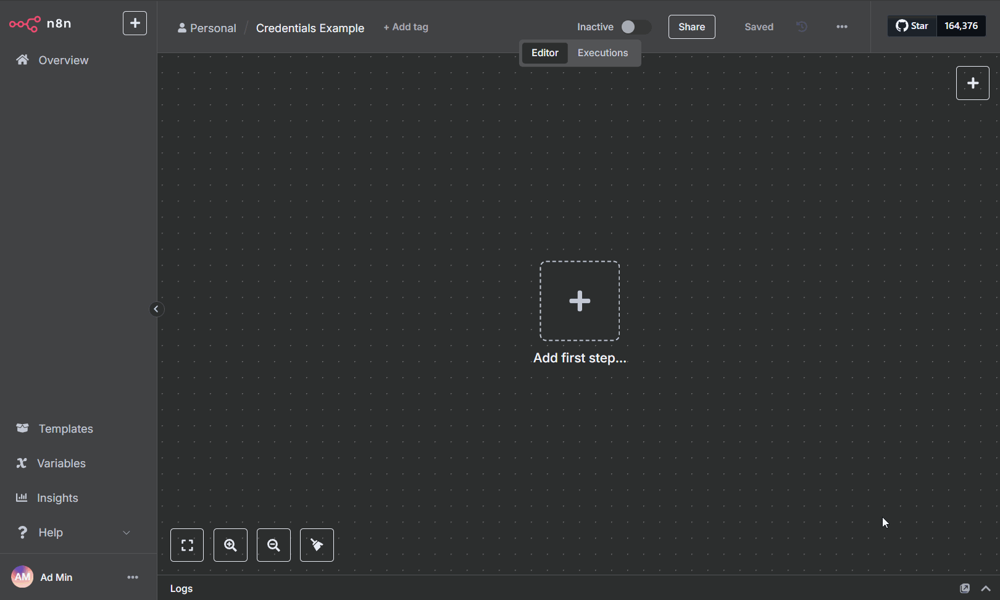
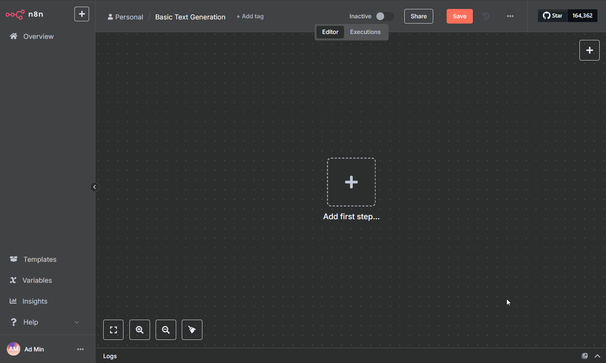
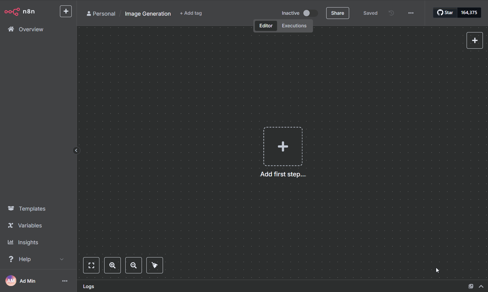

# n8n-nodes-chutes


This is an n8n community node that provides complete access to Chutes.ai's AI services, replicating all features available in the Chutes.ai playground including text generation, image generation, and custom inference.

[Chutes.ai](https://chutes.ai) is an advanced AI platform that provides state-of-the-art models for various AI tasks with a focus on performance and reliability.

## Installation

### Community Node (Recommended)

1. Go to **Settings** > **Community Nodes** in your n8n instance
2. Search for `n8n-nodes-chutes`
3. Click **Install**

### Manual Installation

```bash
npm install n8n-nodes-chutes
```

For self-hosted n8n instances:

```bash
cd ~/.n8n
npm install n8n-nodes-chutes
```

## Authentication

This package supports two authentication methods. By default, only **API Key** authentication is shown. When the n8n server administrator enables **Sign in With Chutes**, users see an additional OAuth option.

### Option A: API Key

1. Sign up at [chutes.ai](https://chutes.ai)
2. Navigate to your [API Keys dashboard](https://chutes.ai/app/api)
3. Create a new API key (you will only be shown it once)
4. In n8n, go to **Credentials** > **New** > select **Chutes API**
5. Enter your API key, choose your environment (Production/Sandbox), and save



### Option B: Sign in With Chutes (OAuth)

When enabled by a server administrator, users can authenticate with their own Chutes account. Each user's API usage is billed to their own account.

**What end users see:** An "Authentication" dropdown in each Chutes node with the option "Sign in With Chutes". Selecting it shows an OAuth credential with a **Connect my account** button. One click opens the Chutes login/consent screen.

**What server admins need to do:** Set two environment variables on the n8n server:

```
CHUTES_OAUTH_CLIENT_ID=cid_xxx
CHUTES_OAUTH_CLIENT_SECRET=csc_xxx
```

Without these, the OAuth option is hidden and only API Key authentication is available.

#### Setting Up OAuth Credentials (CLI Wizard)

The easiest way to register an OAuth app with Chutes and get your credentials is the built-in setup wizard:

```bash
npx n8n-nodes-chutes-setup-oauth
```

The wizard will:
1. Ask for your [Chutes API key](https://chutes.ai/app/api)
2. Let you choose between two modes:
   - **Sign in With Chutes** -- each user connects their own Chutes account
   - **Single account (Advanced)** -- your account pays for all inference
3. Ask for your n8n callback URL (default: `http://localhost:5678/rest/oauth2-credential/callback`)
4. Register the OAuth app with Chutes
5. Write the credentials to your `.env` file (or print them to the screen)

For more details on Sign in With Chutes, see the [official documentation](https://chutes.ai/docs/sign-in-with-chutes/overview).

#### Manual OAuth App Registration

You can also register an OAuth app directly via the Chutes API:

```bash
curl -X POST "https://api.chutes.ai/idp/apps" \
  -H "Authorization: Bearer $CHUTES_API_KEY" \
  -H "Content-Type: application/json" \
  -d '{
    "name": "My n8n Instance",
    "redirect_uris": ["https://<n8n-host>/rest/oauth2-credential/callback"],
    "allowed_scopes": ["openid", "profile", "chutes:invoke"]
  }'
```

#### Optional Environment Variables

| Variable | Description | Default |
|---|---|---|
| `CHUTES_OAUTH_CLIENT_ID` | OAuth client ID from Chutes | _(none -- OAuth disabled)_ |
| `CHUTES_OAUTH_CLIENT_SECRET` | OAuth client secret from Chutes | _(none -- OAuth disabled)_ |
| `CHUTES_SERVER_ACCESS_TOKEN` | Access token for single-account mode (one account pays for all users) | _(none)_ |
| `CHUTES_SERVER_REFRESH_TOKEN` | Refresh token for single-account mode (auto-refreshes the access token) | _(none)_ |
| `CHUTES_IDP_BASE_URL` | Override the identity provider base URL | `https://api.chutes.ai` |
| `CHUTES_CREDENTIAL_TEST_BASE_URL` | Override the credential test endpoint | _(auto-detected from environment)_ |

## Features

This node provides complete access to all Chutes.ai playground features:

### 📝 Text Generation
- **Complete**: Generate text completions with all available models
- **Chat**: Interactive conversations with context and message history
- **Modern Best Practices**: Both operations use the Chat Completions API (`/v1/chat/completions`) following industry standards
- All playground parameters:
  - Temperature (0-2)
  - Max tokens
  - Top P (nucleus sampling)
  - Frequency/presence penalties
  - Stop sequences
  - Response format (text/JSON)
  - Streaming support (planned)
  - Seed for reproducibility

### 🎨 Image Generation
- **Generate**: Create images from text prompts
- **Edit**: Modify existing images with text prompts
  - **Multi-image composition**: Combine multiple images using models like Qwen-Image-Edit-2511
  - Support for 1-3 images per edit (named binaries, URLs, or auto-mapped)
- Multiple size options (256x256 to 1792x1024)
- Quality settings (Standard/HD)
- Style presets (Natural/Vivid)
- Negative prompts
- Guidance scale control
- Seed for reproducibility
- Batch generation support

### 🔧 Inference (coming soon)
- **Predict**: Run custom model inference
- **Batch**: Process multiple inputs efficiently
- **Status**: Check job status for long-running operations
- Support for custom models deployed on Chutes.ai
- Webhook callbacks for async operations
- Priority queue management

## Three Ways to Use Chutes.ai with n8n

This package provides three complementary nodes for different use cases:

### 1. Chutes (Original Workflow Node)

**Use when:** You need direct control over API calls and access to all Chutes.ai features

**Features:**
- 📝 Text generation (completions and chat)
- 🎨 Image generation
- 🎵 Music generation
- 🎤 Speech-to-text and text-to-speech
- 🎥 Video generation
- 📊 Embeddings
- 🛡️ Content moderation
- 🔧 Custom inference

**Perfect for:** Complex workflows that require full control over Chutes.ai API parameters

### 2. Chutes Chat Model

**Use when:** You want to use Chutes.ai with an available AI Agent node

**Features:**
- ✅ Works with Chutes AI Agent
- ✅ **Full tool calling support** - passes tools to API correctly
- ✅ All Chutes LLM models (DeepSeek, Qwen, etc.)
- ✅ Dynamic chute/model selection
- ✅ Temperature and advanced parameters
- ✅ Compatible with AI Agent's Tools, Memory, and Output Parsers

**Quick Start:**
1. Add a **Chutes Chat Model** node
2. Select your chute and model
3. Connect to **AI Agent** node's model input

### 3. Chutes AI Agent (New!)

**Use when:** You want n8n's full AI Agent experience, but exclusively with Chutes.ai models

**Features:**
- 🤖 Functions identically to n8n's AI Agent
- 🔒 **Whitelisted** - Only accepts Chutes Chat Model (ensures Chutes.ai integration)
- 🛠️ **Full tool calling support** - Works with n8n built-in tools (Wikipedia, Calculator, SerpAPI, Code Tool, HTTP Request, Workflow)
- 📞 **OpenAI-compatible function calling** - Works with DeepSeek, Qwen, and other models supporting tools
- 🎯 Direct chute selection (no separate Chat Model node required)
- 💬 Multi-turn conversations with context
- 🎯 System message configuration
- 🔄 Max iterations control
- 📊 Intermediate steps tracking

**Perfect for:** Full AI Agent workflows that must use Chutes.ai models only

**Quick Start:**
1. Add **Chutes AI Agent** node
2. Configure your chute directly (or connect a Chutes Chat Model node)
3. (Optional) Add Tools, Memory, Output Parser
4. Configure prompt and system message
5. Execute!

**Why This Node?** n8n's official AI Agent has a hardcoded whitelist that can limit community model integration. The Chutes AI Agent provides the same functionality while ensuring seamless Chutes.ai integration.

### Which Node Should You Use?

| Use Case | Recommended Node |
|----------|-----------------|
| Complex workflows with multiple AI operations | **Chutes** (Original) |
| Using Chutes official AI Agent with Chutes models | **Chutes Chat Model** |
| AI Agent that ONLY works with Chutes models | **Chutes AI Agent** |
| Image/video/audio generation | **Chutes** (Original) |
| Custom model inference | **Chutes** (Original) |
| Embeddings and content moderation | **Chutes** (Original) |
| Tools, Memory, Output Parser with Chutes | **Chutes AI Agent** |

### Three Nodes, One Package

When you install `n8n-nodes-chutes`, you get all three nodes:

1. **Chutes** - Traditional workflow node for direct API calls to all Chutes.ai features
   - Text generation, image generation, speech, video, embeddings, etc.
   - Full control over API parameters
   - Multi-image edit support for composition workflows
   
2. **Chutes Chat Model** - LangChain-compatible chat model node
   - Connects to Chutes official AI Agent
   - Provides Chutes.ai LLM models to any AI Agent
   - Full tool calling support (OpenAI-compatible)
   - `NodeConnectionType.AiLanguageModel` output
   
3. **Chutes AI Agent** - Complete AI Agent with Chutes-only whitelist
   - Clone of n8n's AI Agent structure
   - **Direct chute selection** (no separate Chat Model required)
   - **Full tool calling support** with LangChain tools
   - Full Tool, Memory, and Output Parser support
   - Perfect for workflows that must use Chutes.ai exclusively

Use the right node for your use case (see the comparison table above).

📚 **Full Guide**: See [docs/AI-AGENT-INTEGRATION.md](docs/AI-AGENT-INTEGRATION.md) for detailed examples and best practices.

## Usage Examples

### Basic Text Generation

Generate creative text using Chutes.ai's LLM models:



<details>
<summary>Click to see full JSON example node</summary>

```json
{
  "nodes": [
    {
      "parameters": {},
      "type": "n8n-nodes-base.manualTrigger",
      "typeVersion": 1,
      "position": [
        0,
        0
      ],
      "id": "207576a8-03fc-427c-b6e3-475891b30a52",
      "name": "When clicking ‘Execute workflow’"
    },
    {
      "parameters": {
        "chuteUrl": "https://chutes-deepseek-ai-deepseek-v3-0324-tee.chutes.ai",
        "prompt": "Write a story about a cat with a hat that sat on a fat stack of pancakes, with syrup dribbled down the side of the pancakes.",
        "additionalOptions": {}
      },
      "type": "CUSTOM.chutes",
      "typeVersion": 1,
      "position": [
        220,
        0
      ],
      "id": "a5e63622-183d-4ac2-84f7-576b6e04ff0b",
      "name": "Chutes",
      "credentials": {
        "chutesApi": {
          "id": "Lv1zGZROIfHD4yIL",
          "name": "Chutes account"
        }
      }
    }
  ],
  "connections": {
    "When clicking ‘Execute workflow’": {
      "main": [
        [
          {
            "node": "Chutes",
            "type": "main",
            "index": 0
          }
        ]
      ]
    }
  },
  "pinData": {},
  "meta": {
    "templateCredsSetupCompleted": true,
    "instanceId": "0766e26a38e4cf9836ab30499d93ee64e5c7b0eae3f1edb925460d34cf41d5c5"
  }
}
```

</details>

### Chat Conversation

Have a multi-turn conversation with context (this example includes basic troubleshooting):


<details>
<summary>Click to see full JSON example node</summary>

```json
{
  "nodes": [
    {
      "parameters": {},
      "type": "n8n-nodes-base.manualTrigger",
      "typeVersion": 1,
      "position": [
        0,
        0
      ],
      "id": "c7bf314b-4232-4f02-9146-439e30aa7437",
      "name": "When clicking ‘Execute workflow’"
    },
    {
      "parameters": {
        "chuteUrl": "https://chutes-moonshotai-kimi-k2-thinking.chutes.ai",
        "operation": "chat",
        "messages": {
          "messageValues": [
            {
              "role": "system",
              "content": "you are the HAL9000 before it went insane, be helpful like the computer in the movie, you are to pretend you are in the movie 2001 a space odyssey, and will not break character. if the user asks questions they are also pretending to be in the movie."
            },
            {
              "content": "can you guess how long before we reach Jupiter, HAL?"
            }
          ]
        },
        "additionalOptions": {
          "maxTokens": 10000
        }
      },
      "type": "CUSTOM.chutes",
      "typeVersion": 1,
      "position": [
        220,
        0
      ],
      "id": "7beb97a8-a59c-4041-b7f2-6be1901c79eb",
      "name": "Chutes",
      "credentials": {
        "chutesApi": {
          "id": "Lv1zGZROIfHD4yIL",
          "name": "Chutes account"
        }
      }
    }
  ],
  "connections": {
    "When clicking ‘Execute workflow’": {
      "main": [
        [
          {
            "node": "Chutes",
            "type": "main",
            "index": 0
          }
        ]
      ]
    }
  },
  "pinData": {},
  "meta": {
    "templateCredsSetupCompleted": true,
    "instanceId": "0766e26a38e4cf9836ab30499d93ee64e5c7b0eae3f1edb925460d34cf41d5c5"
  }
}
```

</details>

### Image Generation

Create stunning images from text descriptions:




<details>
<summary>Click to see full JSON example node</summary>

```json
{
  "nodes": [
    {
      "parameters": {},
      "type": "n8n-nodes-base.manualTrigger",
      "typeVersion": 1,
      "position": [
        0,
        0
      ],
      "id": "4bee9ada-56fe-4cc1-9490-ce87839077dd",
      "name": "When clicking ‘Execute workflow’"
    },
    {
      "parameters": {
        "resource": "imageGeneration",
        "chuteUrl": "https://chutes-qwen-image.chutes.ai",
        "prompt": "a cat in a hat that sat on a fat stack of pancakes, maple syrup flows down the side of the pancakes",
        "additionalOptions": {}
      },
      "type": "CUSTOM.chutes",
      "typeVersion": 1,
      "position": [
        220,
        0
      ],
      "id": "13f40013-4da6-4bc6-b909-95e8e7b1594d",
      "name": "Chutes",
      "credentials": {
        "chutesApi": {
          "id": "Lv1zGZROIfHD4yIL",
          "name": "Chutes account"
        }
      }
    }
  ],
  "connections": {
    "When clicking ‘Execute workflow’": {
      "main": [
        [
          {
            "node": "Chutes",
            "type": "main",
            "index": 0
          }
        ]
      ]
    }
  },
  "pinData": {},
  "meta": {
    "templateCredsSetupCompleted": true,
    "instanceId": "0766e26a38e4cf9836ab30499d93ee64e5c7b0eae3f1edb925460d34cf41d5c5"
  }
}
```

</details>

### Video Generation

Animate stunning images with Video using text descriptions :


<details>
<summary>Click to see full JSON example node</summary>

```json
{
  "nodes": [
    {
      "parameters": {},
      "type": "n8n-nodes-base.manualTrigger",
      "typeVersion": 1,
      "position": [
        -200,
        0
      ],
      "id": "4bee9ada-56fe-4cc1-9490-ce87839077dd",
      "name": "When clicking ‘Execute workflow’"
    },
    {
      "parameters": {
        "resource": "imageGeneration",
        "chuteUrl": "https://chutes-qwen-image.chutes.ai",
        "prompt": "a cat in a hat that sat on a fat stack of pancakes, maple syrup flows down the side of the pancakes",
        "additionalOptions": {}
      },
      "type": "CUSTOM.chutes",
      "typeVersion": 1,
      "position": [
        20,
        0
      ],
      "id": "13f40013-4da6-4bc6-b909-95e8e7b1594d",
      "name": "Chutes",
      "credentials": {
        "chutesApi": {
          "id": "Lv1zGZROIfHD4yIL",
          "name": "Chutes account"
        }
      }
    },
    {
      "parameters": {
        "resource": "videoGeneration",
        "chuteUrl": "https://chutes-wan-2-2-i2v-14b-fast.chutes.ai",
        "operation": "image2video",
        "prompt": "the maple syrup flows down the pancakes slowly while the cat wags his tail",
        "additionalOptions": {}
      },
      "type": "CUSTOM.chutes",
      "typeVersion": 1,
      "position": [
        240,
        0
      ],
      "id": "6b881c17-31d5-4f2a-9553-4dbe5711d0a6",
      "name": "Chutes1",
      "credentials": {
        "chutesApi": {
          "id": "Lv1zGZROIfHD4yIL",
          "name": "Chutes account"
        }
      }
    }
  ],
  "connections": {
    "When clicking ‘Execute workflow’": {
      "main": [
        [
          {
            "node": "Chutes",
            "type": "main",
            "index": 0
          }
        ]
      ]
    },
    "Chutes": {
      "main": [
        [
          {
            "node": "Chutes1",
            "type": "main",
            "index": 0
          }
        ]
      ]
    }
  },
  "pinData": {},
  "meta": {
    "templateCredsSetupCompleted": true,
    "instanceId": "0766e26a38e4cf9836ab30499d93ee64e5c7b0eae3f1edb925460d34cf41d5c5"
  }
}
```

</details>

### Use your Imagination

String together as many n8n nodes as you like, for any reason, no matter how crazy. Chutes Nodes are made to work together :


This workflow can be found in the [Examples Directory](https://github.com/chutesai/n8n-nodes-chutes/tree/main/examples), you will also need [FFmpeg](https://github.com/FFmpeg/FFmpeg) installed to make a GIF - but that can easily be accomplished by [using the docker example found in the tests folder](https://github.com/chutesai/n8n-nodes-chutes/tree/main/tests/n8n-docker).


## Advanced Features

### 🔄 Streaming Support
Enable real-time streaming for text generation to get responses as they're generated, matching the Chutes.ai playground experience.

### ⚡ Rate Limiting (coming soon)
The node automatically handles Chutes.ai rate limits with exponential backoff and retry logic, ensuring reliable operation even under heavy load.

### 🛡️ Error Handling
Comprehensive error messages help you debug issues quickly with detailed Chutes.ai API error information and suggestions.

### 📦 Batch Processing
Process multiple items efficiently with automatic batching for optimal API usage and cost management.

## Playground Feature Parity

This node aims for complete feature parity with the Chutes.ai playground:
- ✅ All models available in the playground
- ✅ All parameters and options
- ✅ Same response formats
- ✅ Identical error handling
- ✅ Real-time streaming
- ✅ Dynamic model loading

## Common Workflows

### Content Generation Pipeline
1. **Chutes Text Generation** → Generate article outline
2. **Chutes Text Generation** → Expand each section
3. **Chutes Image Generation** → Create featured image
4. **Save to Database/CMS**

### AI-Powered Customer Support
1. **Webhook** → Receive customer inquiry
2. **Chutes Chat** → Generate response with context
3. **Chutes Text Generation** → Summarize conversation
4. **Send Response**

### Image Processing Pipeline
1. **Trigger** → New product added
2. **Chutes Image Generation** → Create product images
3. **Chutes Text Generation** → Generate descriptions
4. **Upload to Storage**

## Technical Details

### Chat Completions API

This node uses modern best practices by implementing the Chat Completions API (`/v1/chat/completions`) for **all text generation operations**:

- **Complete Operation**: Internally wraps your prompt as a user message for the Chat Completions API
- **Chat Operation**: Uses the full messages array with system, user, and assistant roles
- **Why This Matters**:
  - ✅ Follows industry standards (OpenAI deprecated `/v1/completions` in favor of chat)
  - ✅ Better quality responses (how modern LLMs are trained)
  - ✅ Consistent behavior across all text operations
  - ✅ No truncation issues (the `/v1/completions` endpoint has known truncation problems on Chutes.ai)

**User Experience**: The UI remains simple - you still enter a prompt for the "Complete" operation. The conversion to chat format happens automatically behind the scenes!

### Dynamic Chute Loading

The node dynamically loads available chutes from the Chutes.ai Management API:

- Fetches all public and your deployed chutes
- Filters by resource type (LLM, Image, Video, Audio, TTS, STT, Music, Embeddings, Moderation)
- Each chute has its own subdomain: `https://{slug}.chutes.ai`
- Automatically routes requests to the correct endpoint

### Error Handling & Retries (better features coming soon)

- Automatic retry logic with exponential backoff (coming soon)
- Handles rate limiting (429 errors)
- Clear error messages for authentication and API issues
- Graceful degradation for optional features

## Resources

- [Chutes.ai Documentation](https://chutes.ai/docs)
- [API Reference](https://chutes.ai/docs/api-reference/overview)
- [Playground](https://chutes.ai/app)
- [n8n Community Forum](https://community.n8n.io)
- [Report Issues](https://github.com/chutesai/n8n-nodes-chutes/issues)

## Support

- **Chutes.ai Support**: [support@chutes.ai](mailto:support@chutes.ai)
- **Node Issues**: [GitHub Issues](https://github.com/chutesai/n8n-nodes-chutes/issues)
- **Community**: [n8n Forum](https://community.n8n.io)

## Development

### Contributing

We welcome contributions! Please follow this workflow:

1. **Fork the repository** on GitHub
2. **Clone your fork** and create a branch from `DEV`:
   ```bash
   git clone https://github.com/YOUR-USERNAME/n8n-nodes-chutes.git
   cd n8n-nodes-chutes
   git checkout DEV
   git checkout -b feature/your-feature-name
   ```
3. **Make your changes** and write tests
4. **Create a Pull Request to `DEV`** (not `main`)

**Important:**
- ❌ Do NOT create PRs directly to `main` - they will be rejected
- ✅ All PRs must target the `DEV` branch
- ✅ All tests must pass before merge

### Local Development Setup

```bash
# Clone the repository
git clone https://github.com/chutesai/n8n-nodes-chutes.git
cd n8n-nodes-chutes

# Checkout DEV branch (always develop from DEV)
git checkout DEV

# Install dependencies
npm install

# Build the node
npm run build

# Link for local development
npm link
cd ~/.n8n/custom
npm link n8n-nodes-chutes

# Start n8n
n8n start
```

### Testing

This project uses Jest for testing and follows Test-Driven Development (TDD).

```bash
# Run all tests
npm test

# Run tests with coverage
npm run test:coverage

# Run tests in watch mode
npm run test:watch

# Run specific test file
npm test -- --testPathPattern="ChutesChatModel"

# Run integration tests (requires CHUTES_API_KEY)
export CHUTES_API_KEY=your_api_key
npm test -- --testPathPattern="tests/integration"
```

**Test Structure:**
- `tests/nodes/` - Unit tests for all nodes
- `tests/integration/` - Integration tests with real API calls
- `tests/credentials/` - Credential configuration tests

See [tests/README.md](tests/README.md) for detailed testing documentation.

## Compatibility

- **Node.js**: 20.12.0 or higher (runtime), 20.12.0+ required for development
- **Chutes.ai API**: v1

## Changelog

### [0.1.1] - 2026-03-26
#### Sign in With Chutes (OAuth)
- **New credential type: Sign in With Chutes** (`ChutesOAuth2Api`) -- users can authenticate with their Chutes account via OAuth 2.0 with PKCE
- **Conditional authentication dropdown** -- Chutes nodes show an "Authentication" selector (API Key / Sign in With Chutes) when OAuth is configured on the server
- **Server-side OAuth configuration** -- client credentials are set via environment variables (`CHUTES_OAUTH_CLIENT_ID`, `CHUTES_OAUTH_CLIENT_SECRET`), never exposed to end users
- **CLI setup wizard** (`npx n8n-nodes-chutes-setup-oauth`) -- interactive tool to register an OAuth app with Chutes and write credentials to `.env`
  - Multi-user mode: each user connects their own Chutes account
  - Single-account mode (Advanced): one account pays for all inference
  - Upgrade flow: detects existing OAuth credentials in `.env` and offers single-account upgrade
- **Dynamic credential routing** -- transport layer resolves the correct credential type at runtime based on user selection

#### Single-Account Server Mode
- **Server-managed authentication** via `CHUTES_SERVER_ACCESS_TOKEN` and `CHUTES_SERVER_REFRESH_TOKEN` environment variables -- one Chutes account pays for all n8n users
- **Automatic token refresh** -- expired server tokens are refreshed transparently using the server refresh token
- **Simplified credential UX** -- when a server account is configured, the API key field shows "Do Not Use" with instructions to simply save the credential; the OAuth dropdown is hidden
- **996 tests passing** with 100% coverage across all credential, node, and script files

### [0.1.0] - 2026-02-15 Official Release
#### Tool Calling Support (AI Agent)
- **Full OpenAI-compatible tool calling** in Chutes AI Agent and Chat Model nodes
- **Tool argument normalization** - automatically extracts values from single-property objects for simple LangChain tools (Wikipedia, Calculator, SerpAPI, Code Tool)
- **Proper tool response format** - sends results with correct `role: 'tool'` and `tool_call_id`
- Works with DeepSeek, Qwen, and other models supporting function calling

#### ChutesAIAgent & ChutesChatModel Improvements
- **Direct chute selection** in Chutes AI Agent - no longer requires separate Chat Model node
- **Removed redundant Model dropdown** from ChutesChatModel
- **Expression support** for chute URL field in both nodes

#### Multi-Image Edit Support
- **Additional Images collection** for image edit operations
- **Compose multiple images** using models like Qwen-Image-Edit-2511
- Support for 1-3 images per edit operation

#### Bug Fixes
- **Fixed duplicate execution bug** in multi-image edit and keyframe operations (50% cost savings)
- **Fixed n8n framework compliance** issues with displayOptions placement

### [0.0.10] - 2026-01-14
#### LTX-2 Full Support
- **Full LTX-2 video generation support** with automatic schema detection
- **New video operations**: Video-to-Video (V2V) and Keyframe Interpolation
- **LoRA adapter support**: 11 LTX-2 LoRAs including camera controls (dolly, jib, static), Canny/Depth/Pose control, and Detailer
- **New I2V parameters**: `image_strength`, `image_frame_index`, `distilled` pipeline option
- **Automatic parameter aliasing**: Maps between Wan2.2 and LTX-2 parameter names (`fps`/`frame_rate`, `frames`/`num_frames`, etc.)
- **Resolution conversion**: Automatically converts resolution strings to width/height with LTX-2 rounding (multiples of 64)
- **Backward compatible**: Wan2.2-fast and other video chutes continue to work without changes
- **779 tests passing** with comprehensive unit and integration test coverage

### [0.0.9] - 2025-10-22
#### Initial Release
- Complete Chutes.ai playground feature parity
- Support for all text generation models via Chat Completions API
- Modern best practices: Uses `/v1/chat/completions` for all text operations
- Image generation with all parameters
- Support for 9 resource types: LLM, Image, Video, Audio, TTS, STT, Music, Embeddings, Moderation
- Custom inference operations
- Dynamic chute loading from Management API
- Comprehensive error handling
- Rate limiting with retry logic
- Dynamic model loading based on selected chute
- Tested and verified with real Chutes.ai API

## License

[MIT](LICENSE)

## Discord

**Chutes**
- Chutes Channel [Invite Link Here](https://discord.gg/chutes)

## Author

**Vonkaiser**
- GitHub: [@vonk](https://github.com/i-beck)

## Acknowledgments

- Thanks to the [n8n team](https://n8n.io) for the amazing workflow automation platform
- Thanks to [Chutes.ai](https://chutes.ai) for providing powerful AI services
- Community contributors and testers

---

Made with respect for the n8n and Chutes.ai communities

